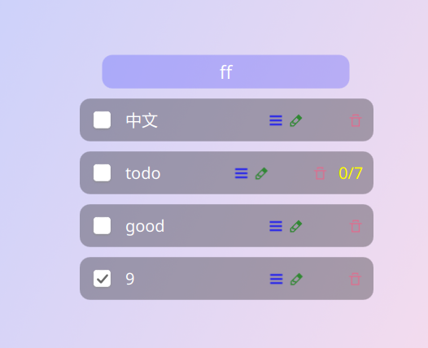

# Q-Todo

A simple TodoLists widget on KDE plasma6

Customized from [qtodo](https://github.com/qinvvv/qtodo)

## Preview

## Features

- [X] transparent background
- [X] auto resort the todos
- [X] fix scrolling(bottom) issues
- [ ] button anchors rearrange
