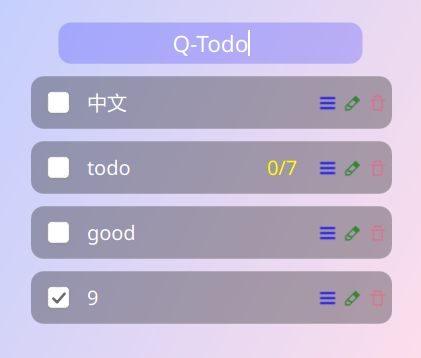
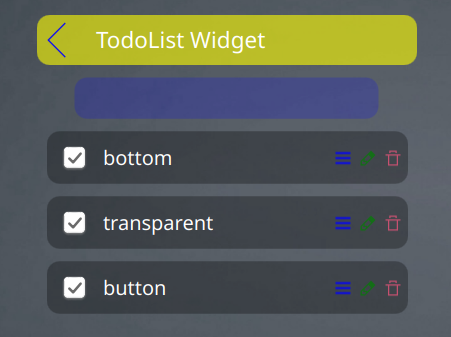

# Q-Todo

A simple TodoLists widget on KDE plasma6

Customized from [qtodo](https://github.com/qinvvv/qtodo)

[KDE Store](https://store.kde.org/p/2196149)

## Preview

## Features

- [X] transparent background
- [X] auto resort the todos
- [X] fix scrolling(bottom) issues
- [X] button anchors rearrange
